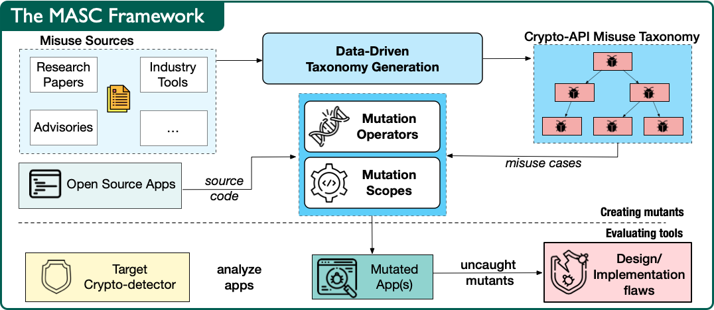

# MASC Artifact

Welcome to the artifact of the paper _Why Crypto-detectors Fail_: A Systematic Evaluation of Cryptographic Misuse Detection Techniques. It contains the source code, apps used for mutation, result logs of the **M**utation **A**nalysis for evaluating **S**tatic **C**rypto-API misuse detectors (MASC) framework as well as an online appendix. The paper has been accepted in [IEEE S&P 2022](https://www.ieee-security.org/TC/SP2022/) (to appear); and as a poster in [NDSS'22](https://www.ndss-symposium.org/ndss2022/)!




## Pre-print of the paper

https://arxiv.org/pdf/2107.07065.pdf

## Online Appendix

Additional details of our paper can be found in the [Online Appendix](Online_appendix.pdf) PDF File.

## Citation

```bib
@inproceedings{masc-oakland'22,
  title = {{Why Crypto-detectors Fail: A Systematic Evaluation of Cryptographic Misuse Detection Techniques}},
  author = {Ami, {Amit Seal} and Cooper, Nathan and Kafle, Kaushal and Moran, Kevin and Poshyvanyk, Denys and Nadkarni, Adwait},
  booktitle = {2022 IEEE Symposium on Security and Privacy (SP)},
  year = {2022},
  month = may,
  sourcecode = {https://github.com/Secure-Platforms-Lab-W-M/masc-artifact},
  pdf = {https://arxiv.org/pdf/2107.07065.pdf},
  publisher = {IEEE Computer Society},
  address = {Los Alamitos, CA, USA},
  issn = {2375-1207},
  pages = {397-414},
  url = {https://doi.ieeecomputersociety.org/10.1109/SP46214.2022.00024}
}
```

## Artifact

We have prepared this artifact that contains the following:

## masc

Contains source code of MASC.

## minimal_flaws

This directory contains the source code of the minimal versions of each Flaw.
It can also be built using Maven to generate a single jar file that contain each Flaw inside of it.

Some of the tools in our study builds the app as part of analysis process, which is why the maven version was created manually based on minimal flaws.
The subdirectories are broken down by Flaw type and contains the corresponding java files for each. These directories additionally contain all of the tools' analysis reports (i.e., CryptoGuard, CogniCrypt, SpotBugs, QARK, CodeQL (both codescanning and LGTM), ShiftLeft, Xanitizer, and Coverity).

The mapping of each minimal version's folder name and its description (i.e., the Flaw type) is located in the file `tool_logs/minimal_flaws/filename_to_flaw_mapper.md`.

## mutated_apps

The mutated and non-mutated source code of the applications

Similarly to the Flaws folder, some tool logs are also located inside of the subdirectory structures, with their mapping in the Mutation Logs folder.
These applications can be built using gradle or maven (from the original apps) depending on the application.

## tool_logs

Tool log mappers containing relative paths to tool logs are in this directory for all mutated and non-mutated apps as well as minimal flaws. The format of each log is dependent on the tool used. For Xanitizer, these logs will be in PDF format containing an overview of bugs in a particular Flaw (e.g., how many issues detected) along with more specific information per issue instance. Coverity uses CSV format documenting issue types, counts, locations, etc.

CryptoGuard, CogniCrypt, and SpotBugs use custom formats which we have placed into markdown files. QARK uses an HTML format containing individual issues detected along with their locations. Lastly, CodeQL (both code-scanning and LGTM) and ShiftLeft Scan use the SARIF format containing individual issues detected and their locations.

## tools_and_scripts

In the `tools_and_scripts` directory, you will find the configurations and some programs/binaries (excluding Xanitizer, Coverity, CodeQL (Codescanner and LGTM) and Shiftleft raw binaries due to their size and/or requirement of licenses) of the different tools we evaluated.

Additionally, for all tools except Xanitizer v4.3.3, Coverity v2020.03, CodeQL (Codescanner and LGTM) (codeql-repo used is included for running the version of codeql queries we performed), and ShiftLeft v1.9.31 (due to their binaries and/or licenses not being provided), we have included a script, `tools_and_scripts/run_tools.sh`, to reproduce our results for all minimal flaws by running the command:


```
bash tools_and_scripts/run_tools.sh minimal_flaws
```

We have also included all the other various scripts we have created to evaluate the other applications (i.e., exhaustive and selective) as well as scripts to summarize certain tools' logs to enable easier interpretability as discussed in our paper. However, due to issues with hard-coded paths, and different build requirements, we do not provide an easy to reproduction script like the one for the minimal Flaws and so these additional scripts are not guaranteed to work out of the box.

**Note 1**: For Coverity, only the scripts for exhaustive and selective are included since all minimal Flaws were run via Coverity's GUI.
However, the Coverity GUI configurations are included.

`tools_and_scripts/script_descriptions.csv` contains descriptions each of the scripts included.

**Note 2**: Any files/descriptions that refer to "reachability" is synonymous to "exhaustive". Similarly, we used "crysl" internally as synonymous to "cognicrypt".

## Acknowledgement

The authors have been supported in part by the NSF-1815336, NSF1815186 and NSF-1955853 grants; as well as [COVA CCI](https://covacci.org/) Cybersecurity Dissertation Fellowship.

